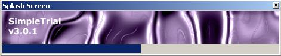



## SimpleTrial v3 \(beta\)

### Description

Beta release of my upcoming project SimpleTrial v3, this new version has a license file creation system called 'TUX', hardware fingerprint system so a license can only be used on one computer to prevent none buyers to get the full version, also the new version has a cool splash startup dialog, please vote :), v3 (full) will be released next month.. this beta version is only a taster of whats to come..
 
### More Info
 

             |
---                |---
**Submitted On**   |2004-08-04 02:14:44
**By**             |[Lee Cook](https://github.com/Planet-Source-Code/PSCIndex/blob/master/ByAuthor/lee-cook.md)
**Level**          |Beginner
**User Rating**    |4.8 (24 globes from 5 users)
**Compatibility**  |VB 6\.0
**Category**       |[Coding Standards](https://github.com/Planet-Source-Code/PSCIndex/blob/master/ByCategory/coding-standards__1-43.md)
**World**          |[Visual Basic](https://github.com/Planet-Source-Code/PSCIndex/blob/master/ByWorld/visual-basic.md)
**Archive File**   |[SimpleTria177837852004\.zip](https://github.com/Planet-Source-Code/lee-cook-simpletrial-v3-beta__1-55389/archive/master.zip)

